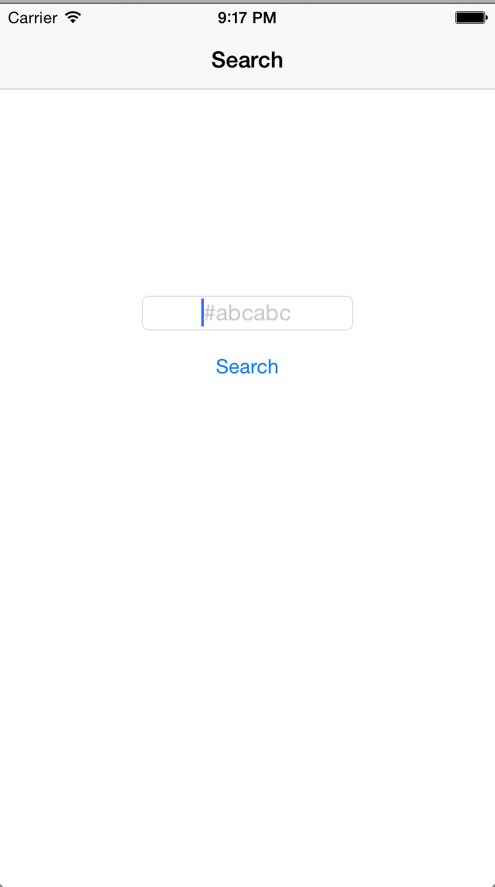
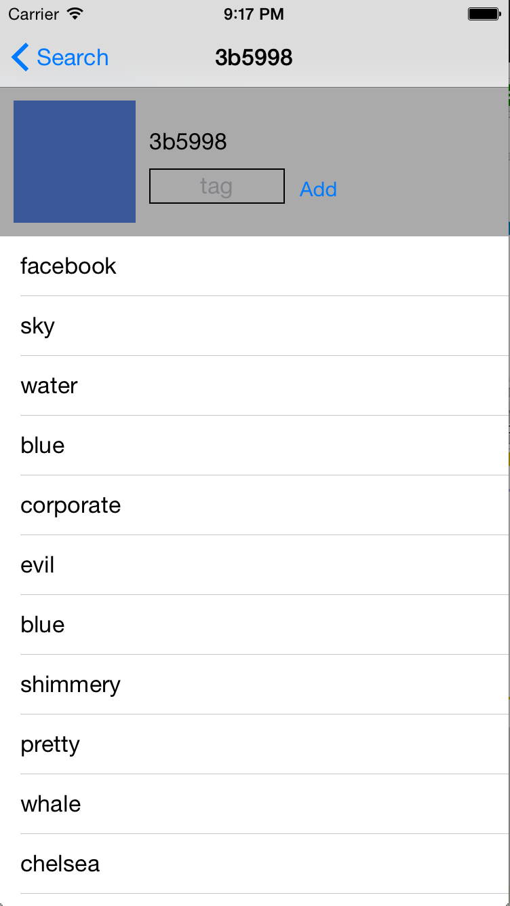
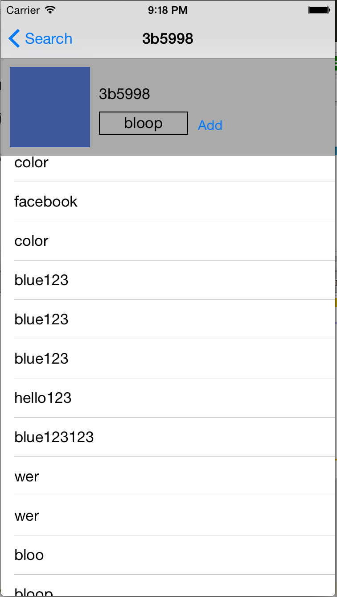

#COLR

###RubyMotion Tutorial by Clay Allsopp

Building a frontend for Colr JSON API. Users can type in a color hex code and then see what tags Colr users have assigned to that color.
If the user is feeling particularly adventurous, they can add a new tag.

LANDING PAGE -SEARCH FOR COLOR TAGS:

COLOR TAG RESULTS:

ADD A COLOR TAG:

